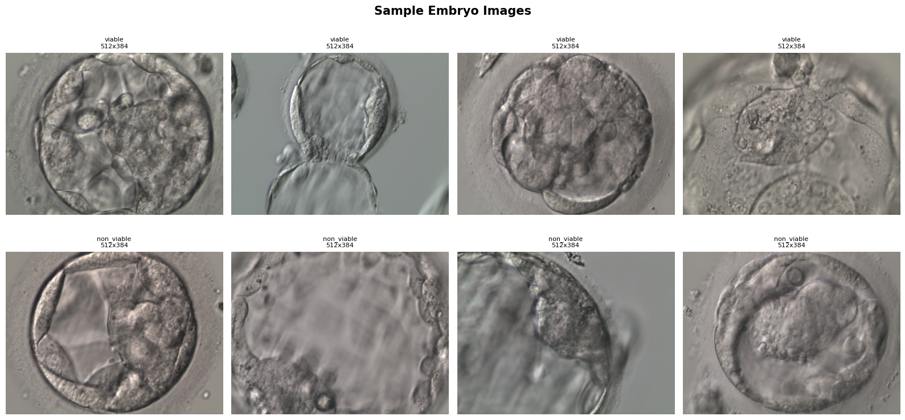
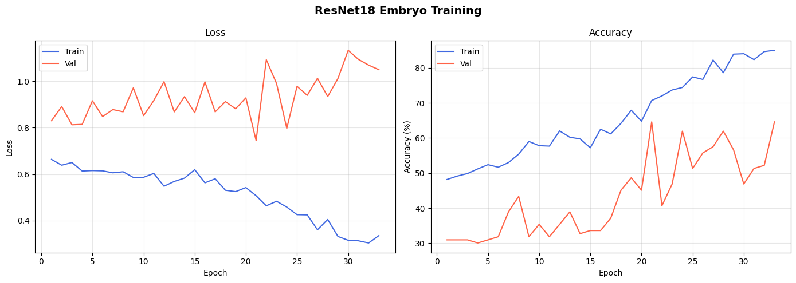
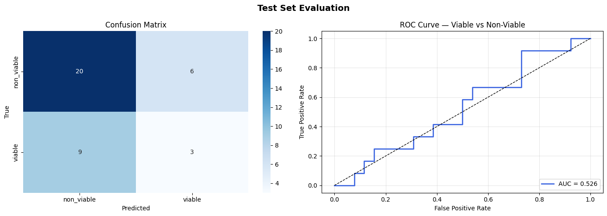
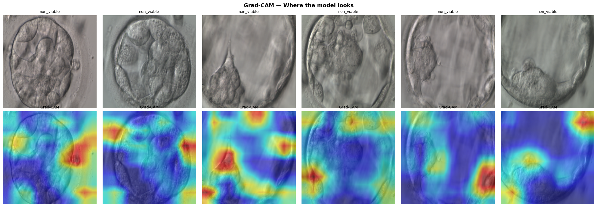
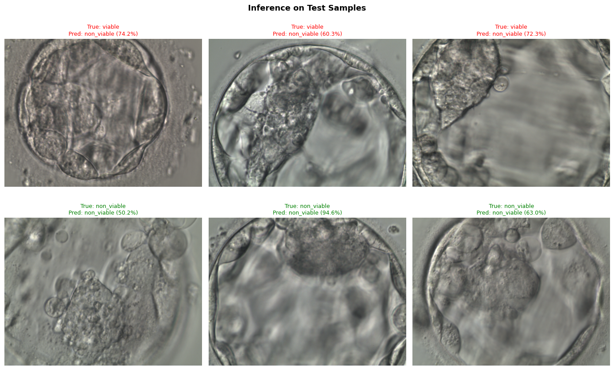

# 🧬 Embryo Viability Classification — ResNet18 Fine-Tuning

> **Binary classification of embryo images (viable / non-viable) using transfer learning on ResNet18.**  
> Platform: Google Colab (T4 GPU) &nbsp;|&nbsp; Framework: PyTorch &nbsp;|&nbsp; Input: 384 × 384 px

---

## 📋 Table of Contents

1. [Project Overview](#1-project-overview)
2. [Dataset](#2-dataset)
3. [Image Preprocessing & Augmentation](#3-image-preprocessing--augmentation)
4. [Model Architecture](#4-model-architecture)
5. [Training Configuration](#5-training-configuration)
6. [Checkpointing & Logging](#6-checkpointing--logging)
7. [Evaluation Methodology](#7-evaluation-methodology)
8. [Inference on New Images](#8-inference-on-new-images)
9. [Model Export](#9-model-export)
10. [Results Summary](#10-results-summary)

---

## 1. Project Overview

This project fine-tunes a **ResNet18** convolutional neural network — pre-trained on ImageNet — to classify embryo microscopy images into two categories:

| Class | Description |
|---|---|
| `viable` | Embryos with developmental potential |
| `non_viable` | Embryos unlikely to result in successful development |

### Key Highlights

- ✅ Transfer learning from ImageNet-pretrained ResNet18
- ✅ Progressive backbone unfreezing (epoch 15 onwards)
- ✅ Weighted random sampler + weighted loss to handle class imbalance
- ✅ Early stopping (patience = 12) to prevent overfitting
- ✅ Grad-CAM visualisation for model interpretability
- ✅ TorchScript export for deployment

---

## 2. Dataset

### 2.1 Source & Structure

```
embryo_dataset_looklike/
└── labelled_embryos/
    └── fine_tuned_labeled/
        ├── viable/        ← class 1
        └── non_viable/    ← class 0
```

- **Original image resolution:** 512 × 384 px
- **Storage:** Google Drive (mounted in Colab)

### 2.2 Sample Images




### 2.3 Train / Val / Test Split

| Split | Proportion | Purpose |
|---|---|---|
| Train | 80% | Parameter optimisation |
| Validation | 15% | Hyperparameter tuning & early stopping |
| Test | 5% | Final unbiased evaluation |

> Splits are stratified per class and seeded (`SEED = 42`) for full reproducibility.

### 2.4 Class Imbalance Handling

Two complementary strategies are used:

1. **`WeightedRandomSampler`** — oversamples the minority class so each epoch sees a balanced number of samples per class.
2. **Weighted Cross-Entropy Loss** — applies a **2.2× higher penalty** to viable class misclassification, further emphasising recall on the minority class.

---

## 3. Image Preprocessing & Augmentation

### 3.1 Normalisation

All images are normalised using ImageNet statistics to align with pre-trained weights:

```python
MEAN = [0.485, 0.456, 0.406]
STD  = [0.229, 0.224, 0.225]
```

### 3.2 Training Augmentations

| Transform | Parameters | Purpose |
|---|---|---|
| `Resize` | 400 × 400 px | Standardise before cropping |
| `RandomCrop` | 384 × 384 px | Spatial position invariance |
| `RandomHorizontalFlip` | p = 0.50 | Left-right symmetry |
| `RandomVerticalFlip` | p = 0.30 | Orientation robustness |
| `RandomRotation` | ± 10° | Minor tilt tolerance |
| `ToTensor + Normalize` | ImageNet stats | Match pretrained weights |

### 3.3 Validation / Test Transforms

No random augmentation — only deterministic, reproducible transforms:

1. `Resize` → 400 × 400 px
2. `CenterCrop` → 384 × 384 px
3. `ToTensor` + `Normalize`

---

## 4. Model Architecture

### 4.1 Backbone — ResNet18

ResNet18 is a residual network with 18 layers, pre-trained on ImageNet (1.2M images, 1000 classes). The global average pooling layer outputs a **512-dimensional** feature vector that feeds into the custom head.

### 4.2 Custom Classification Head

The original `fc` layer is replaced with a deeper, regularised head:

```
ResNet18 Backbone (frozen → unfrozen at epoch 15)
        │
        ▼
   [512] Global Avg Pool
        │
   Linear(512 → 256)
   BatchNorm1d(256)
   ReLU
   Dropout(p=0.50)
        │
   Linear(256 → 64)
   ReLU
   Dropout(p=0.30)
        │
   Linear(64 → 2)      ← logits: [non_viable, viable]
```

### 4.3 Parameter Count

| Phase | Trainable Params |
|---|---|
| Head-only (epochs 1–14) | ~133,000 |
| Full fine-tuning (epochs 15+) | ~11.2 million |

---

## 5. Training Configuration

### 5.1 Hyperparameters

| Hyperparameter | Value | Notes |
|---|---|---|
| Batch Size | 8 | Small batch for high-res inputs |
| Max Epochs | 50 | Upper bound with early stopping |
| LR (Head) | `3e-4` | Higher LR for randomly-initialised layers |
| LR (Backbone) | `1e-5` | Gentle LR to avoid catastrophic forgetting |
| Weight Decay | `1e-3` | L2 regularisation via AdamW |
| Early Stop Patience | 12 epochs | Triggers if val acc doesn't improve |
| Unfreeze Epoch | 15 | Start of full fine-tuning |
| Random Seed | 42 | Full reproducibility |

### 5.2 Optimiser & Scheduler

- **Optimiser:** `AdamW` with two parameter groups (head vs backbone LRs)
- **Scheduler:** `CosineAnnealingLR` — smooth LR decay from initial value down to `1e-6`

### 5.3 Loss Function

```python
criterion = nn.CrossEntropyLoss(weight=torch.tensor([1.0, 2.2]))
#                                                     ↑       ↑
#                                               non_viable  viable
```

The 2.2× weight on viable reduces false negatives — critical in embryo assessment where missing a viable embryo is costly.

### 5.4 Progressive Unfreezing Strategy

```
Epochs  1–14  │ Backbone FROZEN   │ Only head (~133k params) trained
──────────────┼───────────────────┼─────────────────────────────────
Epochs 15–50  │ Backbone UNFROZEN │ Full model fine-tuned at LR=1e-5
```

This prevents early-stage overfitting by letting the head converge first before adapting the convolutional features.

### 5.5 Training Curves



---

## 6. Evaluation Methodology

### 6.1 Test Set Metrics

The best model (by validation accuracy) is evaluated on the held-out test set:

- Overall **Test Accuracy**
- Per-class **Precision, Recall, F1** (sklearn `classification_report`)
- **Confusion Matrix**
- **ROC Curve** + **AUC** score

### 7.2 Confusion Matrix & ROC Curve





### 7.3 Grad-CAM Visualisation




> This is particularly valuable in medical imaging to verify the model is attending to biologically relevant embryo structures rather than image artefacts.

---

## 8. Inference on New Images

A `predict_image()` utility is provided for single-image inference:

```python
pred_class, confidence, viable_prob = predict_image(
    img_path       = "path/to/image.jpg",
    model          = model,
    class_to_idx   = train_ds.class_to_idx,
    threshold      = 0.5          # adjustable decision boundary
)
```

**Output:**

| Return Value | Description |
|---|---|
| `pred_class` | `"viable"` or `"non_viable"` |
| `confidence` | Probability of the predicted class |
| `viable_prob` | Raw softmax probability for viable |

### Inference Sample




---

## 10. Results Summary

| Component | Detail |
|---|---|
| **Base Model** | ResNet18 (ImageNet pretrained) |
| **Task** | Binary — viable vs non-viable embryos |
| **Input Size** | 512 × 384 px |
| **Head** | 512 → 256 → 64 → 2 (BN + ReLU + Dropout) |
| **Optimiser** | AdamW + CosineAnnealingLR |
| **Imbalance Strategy** | WeightedRandomSampler + CE loss weight 2.2× |
| **Regularisation** | Dropout (0.5 + 0.3) + Weight Decay (1e-3) |
| **Training Strategy** | Progressive unfreezing at epoch 15 |
| **Early Stopping** | Patience = 12 on val accuracy |
| **Interpretability** | Grad-CAM on `layer4[-1]` |
| **Export** | `.pth` checkpoint + TorchScript `.pt` + JSON log |
| **Best Val Accuracy** |64.60 %|
| **Test Accuracy** |60.53 %|
| **ROC AUC** |0.5256|

---

*Report generated from [`embryo_resnet18_training_for_report.ipynb`](embryo_resnet18_training_for_report.ipynb)*