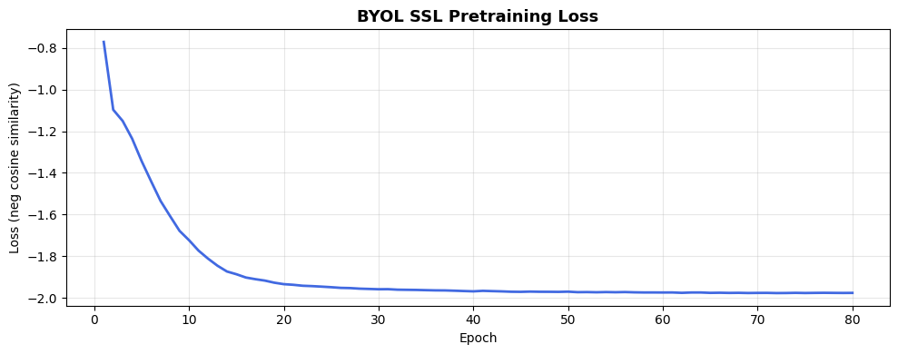
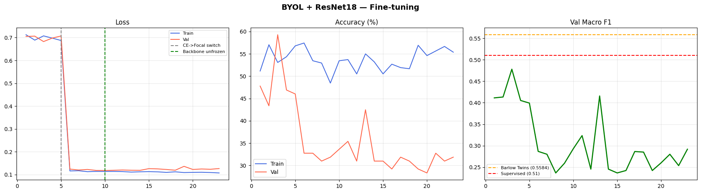
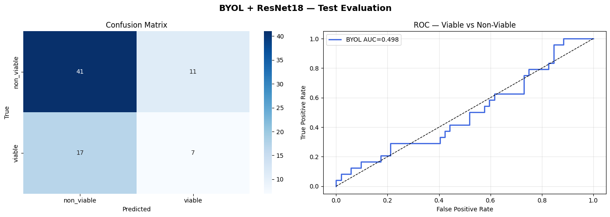

# 🧬 Exp 5 — BYOL + ResNet18 | Embryo Viability Classification

> **Self-supervised pre-training with Bootstrap Your Own Latent (BYOL) → supervised fine-tuning for binary embryo viability classification.**  
> Platform: Google Colab (T4 GPU) &nbsp;|&nbsp; Framework: PyTorch &nbsp;|&nbsp; Backbone: ResNet18 (ImageNet pretrained)

---

## 📋 Table of Contents

1. [Why BYOL?](#1-why-byol)
2. [Pipeline Overview](#2-pipeline-overview)
3. [Dataset](#3-dataset)
4. [Phase 1 — BYOL SSL Pre-training](#4-phase-1--byol-ssl-pre-training)
5. [Phase 2 — Downstream Classification](#5-phase-2--downstream-classification)
6. [Model Architecture](#6-model-architecture)
7. [Training Configuration](#7-training-configuration)
8. [Evaluation](#8-evaluation)
9. [Saved Artefacts](#9-saved-artefacts)
10. [Experiment Comparison](#10-experiment-comparison)
11. [Results Summary](#11-results-summary)

---

## 1. Why BYOL?

BYOL is chosen over the previous Barlow Twins (Exp 4) approach for several reasons specific to this small embryo dataset:

| Property | Barlow Twins (Exp 4) | **BYOL (Exp 5)** |
|---|---|---|
| Large batch required | Yes | **No** |
| Negative samples | No | No |
| Architecture | Single network | **Online + Target (EMA)** |
| Loss function | Cross-correlation matrix | **Negative cosine similarity** |
| Small dataset fit | Good | **Better** |

BYOL avoids representational collapse without needing negative pairs or large batches — both limitations matter here given ~2344 total images.

---

## 2. Pipeline Overview

```
┌──────────────────────────────────────────────────────────────────┐
│  PHASE 1 — BYOL Self-Supervised Pre-training                     │
│                                                                  │
│  All embryo images (labelled + unlabelled, no labels used)       │
│          ↓                                                       │
│  Two augmented views of each image                               │
│          ↓                                                       │
│  Online network (encoder + projector + predictor)                │
│          ↓  ←  EMA update each batch                            │
│  Target network (encoder + projector, no gradients)              │
│          ↓                                                       │
│  Loss: symmetric negative cosine similarity                      │
│          ↓                                                       │
│  Save: byol_pretrained.pth  (online encoder backbone)           │
└──────────────────────────────────────────────────────────────────┘
                          ↓
┌──────────────────────────────────────────────────────────────────┐
│  PHASE 2 — Supervised Fine-tuning (labelled images only)         │
│                                                                  │
│  Load pre-trained backbone → freeze → add classifier head        │
│          ↓  (epoch 5: CE loss → Focal Loss)                     │
│          ↓  (epoch 10: unfreeze backbone, full fine-tune)        │
│  Train end-to-end with AdamW + CosineAnnealingLR                │
│          ↓                                                       │
│  Save: byol_best_finetuned.pth  (best val macro F1)             │
└──────────────────────────────────────────────────────────────────┘
```

---

## 3. Dataset

### 3.1 Image Sources

| Source | Labels | Used in |
|---|---|---|
| `fine_tuned_labeled/viable/` | Yes | Phase 1 (SSL) + Phase 2 (classifier) |
| `fine_tuned_labeled/non_viable/` | Yes | Phase 1 (SSL) + Phase 2 (classifier) |
| `pretrained_unlabeled/` | No | Phase 1 (SSL) only |
| **Total SSL pool** | — | **~2344 images** |
| **Total labelled** | — | **~754 images** |

### 3.2 Train / Val / Test Split (Phase 2)

Split is applied to the 754 labelled images only:

| Split | Proportion | Approximate size |
|---|---|---|
| Train | 75% | ~565 images |
| Validation | 15% | ~113 images |
| Test | 10% | ~76 images |

> All splits seeded with `SEED = 42`. Split ratios derived from `test_size=0.25` then `test_size=0.40` on the held-out portion.

### 3.3 Class Imbalance Handling (Phase 2)

- **WeightedRandomSampler** — oversamples the minority class so each epoch is balanced
- Effective oversampling target: `max_class_count × num_classes` samples per epoch

---

## 4. Phase 1 — BYOL SSL Pre-training

### 4.1 How BYOL Works

1. Each image produces **two differently augmented views** (view1, view2)
2. **Online network** processes both views: encoder → projector → **predictor**
3. **Target network** processes both views: encoder → projector (no predictor, no gradients)
4. Loss = negative cosine similarity between online **predictions** and target **projections**, computed symmetrically in both directions
5. Target network is updated every batch via **Exponential Moving Average (EMA)** of the online network — no back-propagation through target

The predictor asymmetry is what prevents representational collapse without needing negative samples.

### 4.2 SSL Augmentation Pipeline

Both views use the same augmentation stack:

| Transform | Value | Purpose |
|---|---|---|
| Resize | 128 × 128 px | Fast training at reduced resolution |
| RandomHorizontalFlip | p = 0.5 | Symmetry invariance |
| RandomVerticalFlip | p = 0.3 | Orientation robustness |
| RandomRotation | ± 20° | Tilt tolerance |
| ColorJitter | brightness/contrast 0.4, saturation 0.2, hue 0.05 | Colour invariance |
| RandomGrayscale | p = 0.2 | Texture focus |
| GaussianBlur | kernel 5×5, σ ∈ [0.1, 2.0] | Scale invariance |
| Normalize | ImageNet mean/std | Align with pretrained weights |

> Input resolution intentionally set to 128×128 (down from 224) — gives ~4× faster training with negligible SSL quality loss.

### 4.3 SSL Pre-training Hyperparameters

| Parameter | Value |
|---|---|
| Epochs | 100 |
| Batch Size | 64 |
| Learning Rate | `3e-4` |
| Weight Decay | `1e-4` |
| Optimiser | AdamW (online encoder + predictor only) |
| Scheduler | CosineAnnealingLR (`eta_min = 1e-6`) |
| EMA Decay (τ) | `0.996` |
| Projector dims | 512 → 256 → 128 |
| Predictor dims | 128 → 256 → 128 |
| Input size | 128 × 128 px |

### 4.4 SSL Loss Curve



> Expected behaviour: loss starts near **-1.0** and converges toward **-2.0**. A plateau near -2.0 means the representations have stabilised.

---

## 5. Phase 2 — Downstream Classification

### 5.1 Fine-tuning Strategy

Training is divided into three sub-phases:

```
Epochs  1–5    │ Backbone FROZEN   │ Loss: CrossEntropy (stable warmup)
Epochs  6–10   │ Backbone FROZEN   │ Loss: Focal Loss   (focus on hard examples)
Epochs 11–80   │ Backbone UNFROZEN │ Loss: Focal Loss   │ Full end-to-end fine-tune
                                     LR backbone = 1e-5  (10× lower than head)
```

### 5.2 Fine-tuning Augmentations

| Transform | Value |
|---|---|
| Resize | 400 × 400 px |
| RandomCrop | 384 × 384 px |
| RandomHorizontalFlip | p = 0.5 |
| RandomVerticalFlip | p = 0.3 |
| RandomRotation | ± 10° |
| Normalize | ImageNet mean/std |

Validation/test: Resize → CenterCrop (384) → Normalize only.

### 5.3 Focal Loss

Focal Loss is used from epoch 6 onwards to focus training on hard, misclassified examples:

```python
FocalLoss(alpha=0.65, gamma=1.5)
# alpha=0.65 → higher weight on viable (minority class)
# gamma=1.5  → down-weights easy, well-classified examples
```

CrossEntropy is used for the first 5 warmup epochs to stabilise early training before switching.

### 5.4 Fine-tuning Curves




---

## 6. Model Architecture

### 6.1 Phase 1 — BYOL Network

```
                     ┌─────────────────────────────┐
 View 1 ──────────►  │  ONLINE NETWORK              │
                     │  ResNet18 encoder (512-d)    │
                     │  → Projector MLP (→128-d)    │
                     │  → Predictor MLP (→128-d)    │ ──► pred_1
                     └─────────────────────────────┘
                               │  EMA update (τ=0.996)  ↓
                     ┌─────────────────────────────┐
 View 2 ──────────►  │  TARGET NETWORK              │
                     │  ResNet18 encoder (512-d)    │
                     │  → Projector MLP (→128-d)    │ ──► proj_2
                     └─────────────────────────────┘

 Loss = -cosine_sim(pred_1, proj_2) - cosine_sim(pred_2, proj_1)
```

**MLP structure (both projector and predictor):**
```
Linear(in → hidden, bias=False) → BatchNorm1d → ReLU → Linear(hidden → out)
```

### 6.2 Phase 2 — Classifier

The **online encoder's ResNet18 backbone** (without the projector) is extracted and a classification head is attached:

```
BYOL Pre-trained ResNet18 Encoder  (frozen → unfrozen at epoch 10)
        │
        ▼  [batch, 512]
   Linear(512 → 256)
   BatchNorm1d(256)
   ReLU
   Dropout(p=0.50)
        │
   Linear(256 → 64)
   ReLU
   Dropout(p=0.30)
        │
   Linear(64 → 2)      ← logits: [non_viable, viable]
```

### 6.3 Parameter Count

| Phase | Component | Trainable Params |
|---|---|---|
| Phase 1 | Online encoder + predictor | ~11.2M |
| Phase 2 (frozen) | Head only | ~133K |
| Phase 2 (unfrozen) | Full network | ~11.3M |

---

## 7. Training Configuration

### 7.1 Full Hyperparameter Table

| Parameter | Phase 1 (SSL) | Phase 2 (Fine-tune) |
|---|---|---|
| Epochs | 100 | 80 (early stop patience=20) |
| Batch size | 64 | 16 |
| Input size | 128 × 128 | 384 × 384 |
| LR (head) | — | `1e-3` |
| LR (backbone) | `3e-4` | `1e-5` (after unfreeze) |
| Weight decay | `1e-4` | `1e-3` |
| Optimiser | AdamW | AdamW |
| Scheduler | CosineAnnealingLR | CosineAnnealingLR |
| Loss | Neg. cosine similarity | CE (warmup) → Focal Loss |
| Best model metric | Lowest SSL loss | Highest val macro F1 |
| Seed | 42 | 42 |

---

## 8. Evaluation

### 8.1 Test Set Metrics

Evaluated on the held-out test set using the best checkpoint (by validation macro F1):

- **Test Accuracy**
- **Test Macro F1** (primary metric — balances both classes)
- **Per-class Precision, Recall, F1**
- **Confusion Matrix**
- **ROC Curve + AUC**

### 8.2 Confusion Matrix & ROC Curve


---

## 9. Saved Artefacts

All outputs are saved to Google Drive:

| File | Drive Path | Contents |
|---|---|---|
| `byol_pretrained.pth` | `embryo_checkpoints/byol/` | Best SSL model (full BYOL — both networks) |
| `byol_best_finetuned.pth` | `embryo_checkpoints/byol/` | Best classifier checkpoint (weights + history + metadata) |
| `final_byol_resnet18.pth` | `embryo_checkpoints/byol/` | Final model with all metrics + both histories |
| `byol_scripted.pt` | `embryo_checkpoints/byol/` | TorchScript export for deployment |
| `byol_ssl_curve.png` | `embryo_logs/byol/` | SSL pre-training loss curve |
| `byol_ft_curves.png` | `embryo_logs/byol/` | Fine-tuning loss, accuracy, F1 curves |
| `byol_evaluation.png` | `embryo_logs/byol/` | Confusion matrix + ROC curve |
| `comparison_table.json` | `embryo_logs/byol/` | Exp 1 / Exp 4 / Exp 5 comparison |

### Reload Classifier

```python
ckpt = torch.load("final_byol_resnet18.pth")
ft_model.load_state_dict(ckpt["model_state_dict"])
# ckpt["class_to_idx"]  → {"non_viable": 0, "viable": 1}
# ckpt["best_val_f1"]   → best validation macro F1
# ckpt["test_f1"]       → test macro F1
# ckpt["test_acc"]      → test accuracy
# ckpt["roc_auc"]       → test ROC AUC
```

---

## 10. Experiment Comparison

The notebook tracks three experiments against each other:

| Experiment | Method | Test Macro F1 | Test Acc | AUC | Unlabelled data |
|---|---|---|---|---|---|
| Exp 1 — ResNet18 | Supervised only | 0.5100 | 60.53% | 0.5256 | ✗ |
| Exp 4 — Barlow Twins | SSL pre-training | 0.5584 | 59.21% | 0.5569 | ✓ |
| **Exp 5 — BYOL** | **SSL pre-training** | _(fill in)_ | _(fill in)_ | _(fill in)_ | ✓ |

> The F1 panel in `byol_ft_curves.png` plots val macro F1 over epochs with Barlow Twins (0.5584) and Supervised (0.51) reference lines for direct visual comparison.

---

## 11. Results Summary

| Component | Detail |
|---|---|
| **Experiment** | Exp 5 |
| **Method** | BYOL self-supervised pre-training → fine-tuning |
| **Backbone** | ResNet18 (ImageNet pretrained) |
| **SSL data** | ~2344 images (labelled + unlabelled, no labels used) |
| **Classifier data** | ~754 labelled images |
| **SSL input size** | 128 × 128 px (fast training) |
| **Classifier input size** | 384 × 384 px |
| **EMA decay (τ)** | 0.996 |
| **Loss** | CrossEntropy (warmup 5 ep) → Focal Loss (α=0.65, γ=1.5) |
| **Imbalance handling** | WeightedRandomSampler + Focal Loss alpha |
| **Fine-tune strategy** | Head-only (10 ep) → full network unfreeze |
| **Early stopping** | Patience = 20 on val macro F1 |
| **Export** | `.pth` checkpoint + TorchScript `.pt` |
| **Best Val F1** |0.4781 |
| **Test Accuracy** | 63.16% |
| **Test Macro F1** |  0.5394 |
| **ROC AUC** | 0.4976 |

---

*Report generated from 
[`BYOL_resnet `](BYOL_ResNet18_Report.md)

