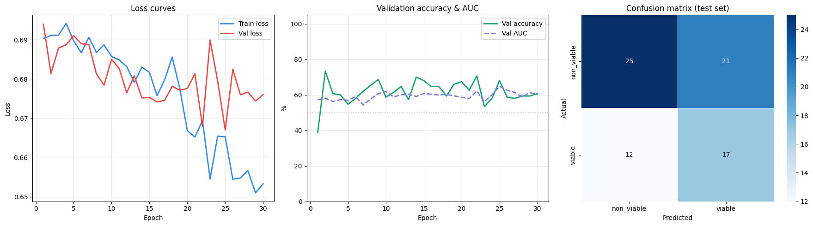
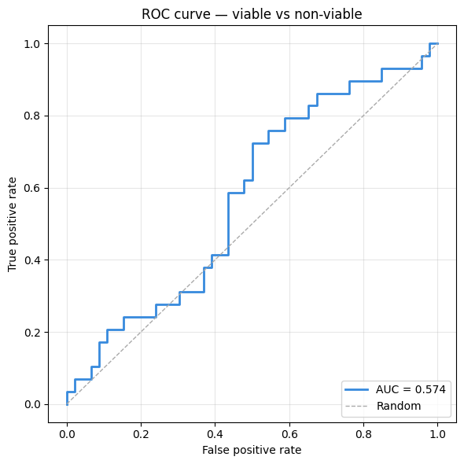
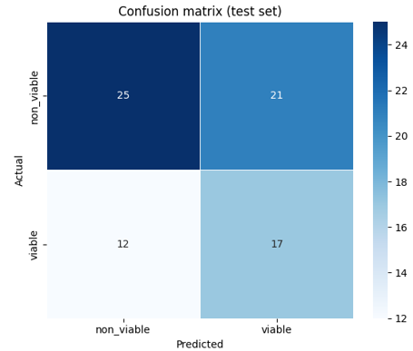
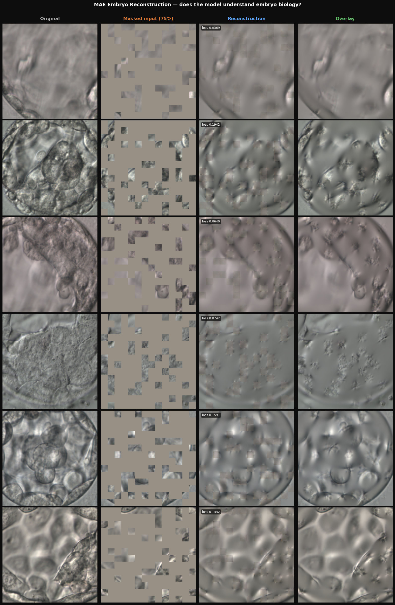

# 🧬 Embryo Viability — Masked Autoencoder (MAE) Report

> **Two-stage pipeline: self-supervised pre-training with MAE → full fine-tuning for binary viability classification.**  
> Platform: Google Colab (T4 GPU) &nbsp;|&nbsp; Framework: PyTorch + HuggingFace Transformers &nbsp;|&nbsp; Backbone: ViT-MAE-Base (Facebook)

---

## 📋 Table of Contents

1. [Pipeline Overview](#1-pipeline-overview)
2. [Stage 1 — MAE Pre-training](#2-stage-1--mae-pre-training)
3. [Stage 2 — Downstream Classification](#3-stage-2--downstream-classification)
4. [Model Architecture](#4-model-architecture)
5. [Training Configuration](#5-training-configuration)
6. [Evaluation Methodology](#6-evaluation-methodology)
7. [Reconstruction Visualisation](#7-reconstruction-visualisation)
8. [Inference on New Images](#8-inference-on-new-images)
9. [Saved Artefacts](#9-saved-artefacts)
10. [Results Summary](#10-results-summary)

---

## 1. Pipeline Overview

This project follows a two-stage self-supervised learning approach for embryo viability classification:

```
┌─────────────────────────────────────────────────────────────────┐
│  STAGE 1 — Unsupervised Pre-training (MAE.ipynb)                │
│                                                                  │
│   All embryo images (unlabelled)                                 │
│          ↓                                                       │
│   ViT-MAE-Base  →  mask 75% patches  →  reconstruct image       │
│          ↓                                                       │
│   Learns rich embryo-specific representations                   │
│          ↓                                                       │
│   Save: embryo_mae_encoder.pth                                  │
└─────────────────────────────────────────────────────────────────┘
                          ↓
┌─────────────────────────────────────────────────────────────────┐
│  STAGE 2 — Supervised Fine-tuning (MAE_classification.ipynb)    │
│                                                                  │
│   Labelled embryos (viable / non_viable)                        │
│          ↓                                                       │
│   Load pre-trained encoder  →  unfreeze  →  add Linear head     │
│          ↓                                                       │
│   Train full network end-to-end                                 │
│          ↓                                                       │
│   Save: embryo_viability_classifier.pth                         │
└─────────────────────────────────────────────────────────────────┘
```

### Why MAE?

Traditional supervised learning requires large labelled datasets. Embryo labelling is expensive and requires clinical expertise. MAE pre-training allows the model to learn the visual structure of embryos from **unlabelled images first**, then transfer that knowledge to the classification task with far fewer labelled examples.

---

## 2. Stage 1 — MAE Pre-training

### 2.1 Dataset

- **Source:** All embryo images (unlabelled pool) from Google Drive
- **Path:** `/content/drive/MyDrive/AI-Embryo/all_embryo`
- **No class labels required** — self-supervised learning

### 2.2 How MAE Works

1. An image is divided into **fixed-size patches** (16×16 px)
2. **75% of patches are randomly masked** (hidden from the model)
3. The encoder sees only the **25% visible patches**
4. A lightweight decoder attempts to **reconstruct the full image**
5. Loss is the pixel-level MSE on the masked patches only


### 2.3 Pre-training Augmentations

| Transform | Value |
|---|---|
| Resize | 256 × 256 px |
| CenterCrop | 224 × 224 px |
| RandomHorizontalFlip | p = 0.5 |
| RandomRotation | ± 5° |
| Normalize | ImageNet mean/std |

### 2.4 Pre-training Hyperparameters

| Parameter | Value |
|---|---|
| Backbone | `facebook/vit-mae-base` (pretrained) |
| Image Size | 224 × 224 px |
| Batch Size | 128 |
| Epochs | 40 |
| Learning Rate | `1e-4` |
| Weight Decay | `0.05` |
| Optimiser | AdamW |
| Scheduler | CosineAnnealingLR (`eta_min = 1e-6`) |
| Mask Ratio | 75% (MAE default) |
| Platform | Google Colab T4 GPU |

### 2.5 Checkpointing

| File | When Saved | Contents |
|---|---|---|
| `best_mae_full_model.pth` | Every time epoch loss improves | model weights, optimiser state, epoch, loss |
| `mae_epoch_N.pth` | Every epoch | model weights, optimiser state, loss |
| `embryo_mae_encoder.pth` | After training | Encoder-only weights (no decoder) |
| `embryo_features.pt` | After training | CLS token embeddings for the full dataset |

### 2.6 Reconstruction Quality Verdict

After training, 6 random images are reconstructed and evaluated:

| Avg Loss | Quality |
|---|---|
| < 0.08 | Excellent — model clearly understands embryo structure |
| 0.08 – 0.10 | Good — key structures visible, minor blurring |
| 0.10 – 0.13 | Fair — rough outlines recovered, consider more epochs |
| > 0.13 | Poor — blurry blobs, needs more training |

---

## 3. Stage 2 — Downstream Classification

### 3.1 Dataset

- **Source:** Labelled embryo images
- **Path:** `.../labelled_embryos/fine_tuned_labeled`
- **Classes:** `non_viable` (index 0), `viable` (index 1)

### 3.2 Dataset Split

| Split | Proportion | Size (approx.) |
|---|---|---|
| Train | 70% | — |
| Validation | 20% | — |
| Test | 10% | — |

> All splits seeded with `SEED = 42` for reproducibility.

### 3.3 Class Imbalance Handling

Class weights are computed from training set frequencies and applied to the loss:

```python
class_weights = (1.0 / class_counts)
class_weights = class_weights / class_weights.sum() * num_classes
criterion = nn.CrossEntropyLoss(weight=class_weights)
```

Rarer classes automatically receive higher loss weights.

### 3.4 Training Augmentations (Classification)

| Transform | Value | Purpose |
|---|---|---|
| Resize | 256 × 256 px | Standardise |
| RandomCrop | 224 × 224 px | Positional invariance |
| RandomHorizontalFlip | p = 0.5 | Symmetry |
| RandomVerticalFlip | p = 0.3 | Orientation robustness |
| RandomRotation | ± 15° | Tilt tolerance |
| ColorJitter | brightness/contrast ± 0.2 | Lighting variation |
| Normalize | ImageNet stats | Match pretrained weights |

---

## 4. Model Architecture

### 4.1 Full Fine-Tuner

The encoder loaded from Stage 1 is **completely unfrozen** and trained end-to-end with a single linear classification head:

```
MAE Pre-trained ViT Encoder  (unfrozen — all params train)
        │
        ▼
   CLS Token  [batch, 768]
        │
   Linear(768 → 2)     ← classification head
        │
   logits: [non_viable, viable]
```

> **Note:** The notebook evolved from a frozen *Linear Probe* to full fine-tuning. The commented-out `LinearProbe` class (encoder frozen, head-only training) was the first phase. The final `FullFineTuner` class unfreezes the encoder for better performance.

### 4.2 Parameter Count

| Component | Parameters |
|---|---|
| ViT-MAE-Base Encoder | ~86 million |
| Linear Head | 768 × 2 = 1,536 |
| **Total Trainable** | **~86 million** |

---

## 5. Training Configuration

### 5.1 Hyperparameters

| Parameter | Value | Notes |
|---|---|---|
| Batch Size | 32 | Classification training |
| Epochs | 30 | With best-AUC checkpointing |
| Learning Rate | `1e-5` | Low LR — encoder already pre-trained |
| Weight Decay | `1e-4` | L2 regularisation |
| Optimiser | AdamW | All parameters |
| Scheduler | CosineAnnealingLR (`eta_min = 1e-6`) | Smooth decay |
| Best Model Metric | Validation AUC-ROC | Saved to `best_full_finetune.pth` |
| Seed | 42 | Reproducibility |

### 5.2 Training Curves



---

## 6. Evaluation Methodology

### 6.1 Test Set Metrics

The best checkpoint (by validation AUC) is evaluated on the held-out test set:

- **Accuracy** — overall correct predictions
- **AUC-ROC** — area under the receiver operating characteristic curve
- **Precision, Recall, F1** per class (sklearn `classification_report`)
- **Confusion Matrix**
- **ROC Curve**

### 6.2 ROC Curve



### 6.3 Confusion Matrix



## 7. Reconstruction Visualisation

After MAE pre-training, a dedicated visualiser cell generates a reconstruction grid for 6 randomly sampled embryo images. Each row shows:

| Column | Description |
|---|---|
| **Original** | Clean input image |
| **Masked input (75%)** | Only 25% of patches visible (grey = masked) |
| **Reconstruction** | Full image predicted by decoder |
| **Overlay** | Reconstructed patches placed on original visible patches |

A per-image reconstruction loss is shown on each panel, and a quality verdict is printed based on the average loss.



---

---

## 10. Results Summary

| Component | Detail |
|---|---|
| **Approach** | Self-supervised MAE pre-training → supervised fine-tuning |
| **Backbone** | `facebook/vit-mae-base` (ViT-Base, patch 16, 224px) |
| **Pre-training Task** | Reconstruct 75% masked image patches |
| **Pre-training Data** | All embryo images (unlabelled) |
| **Classification Data** | Labelled `viable` / `non_viable` images |
| **Encoder** | ViT-Base — 12 transformer blocks, 768-d, 86M params |
| **Classification Head** | Linear(768 → 2) |
| **Fine-tuning Strategy** | Full network unfrozen (end-to-end) |
| **Imbalance Handling** | Inverse-frequency class weights in CE loss |
| **Optimiser** | AdamW + CosineAnnealingLR |
| **Best Metric** | Validation AUC-ROC |
| **Pre-training Epochs** | 40 |
| **Classification Epochs** | 30 |
| **Best Val AUC** | 0.6475  |
| **Test Accuracy** | 56.0 % |
| **Test AUC-ROC** | 0.5742 |


*Report generated from 
[`MAE classification file `](MAE_classification.ipynb) and[`MAE file`](MAE.ipynb)