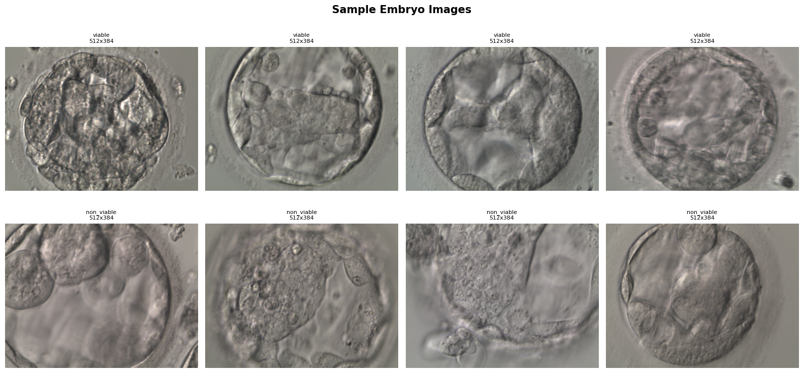
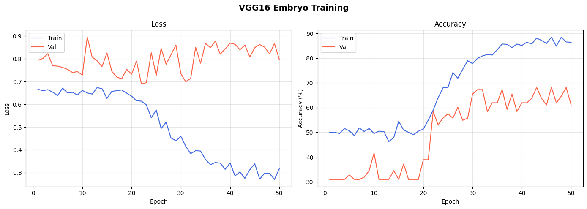
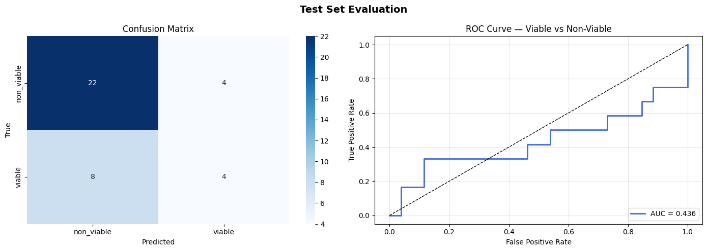
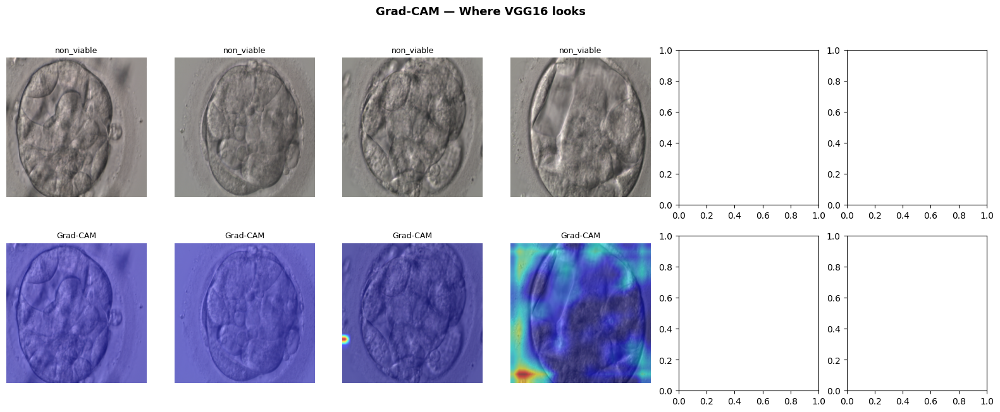

# VGG16 Embryo Viability Classification — Training Report

**Date:** May 2026  
**Architecture:** VGG16 (ImageNet pretrained, progressive fine-tuning)  
**Task:** Binary classification — `viable` vs `non_viable` embryo images  
**Hardware:** Tesla T4 GPU (15.6 GB VRAM)

---

## 1. Dataset

| Split | non_viable | viable | Total |
|-------|-----------|--------|-------|
| Train | 416 | 187 | 603 |
| Val   | 78  | 35  | 113 |
| Test  | 26  | 12  | 38  |
| **Total** | **520** | **234** | **754** |

The dataset is notably imbalanced — non-viable embryos outnumber viable ones roughly **2.2 : 1**. This was addressed using:

- **WeightedRandomSampler** during training (oversamples viable to balance each epoch)
- **CrossEntropyLoss with class weights** `[1.0, 2.2]` penalising misclassified viable embryos more heavily





---

## 2. Experimental Setup

### Model Architecture

VGG16 was loaded with ImageNet weights. The original `classifier[6]` layer (`Linear(4096 → 1000)`) was replaced with a custom head:

```
Linear(4096 → 256) → BatchNorm1d → ReLU → Dropout(0.5)
  → Linear(256 → 64) → ReLU → Dropout(0.3)
  → Linear(64 → 2)
```

The two upstream 4096-dim FC layers from VGG16's pretrained classifier were retained.

| Parameter | Value |
|-----------|-------|
| Total parameters | 135,326,466 |
| Trainable (Phase 1 — head only) | 1,065,922 |
| Trainable (Phase 2 — after unfreeze) | 127,691,202 |

### Training Configuration

| Hyperparameter | Value |
|---------------|-------|
| Input crop size | 384 × 384 px |
| Batch size | 4 |
| Max epochs | 50 |
| Head learning rate (`LR_HEAD`) | 3 × 10⁻⁴ |
| Backbone learning rate (`LR_FEATURE`) | 5 × 10⁻⁶ |
| Weight decay | 1 × 10⁻³ |
| Early stopping patience | 12 epochs |
| Backbone unfreeze epoch | 16 |
| LR scheduler | CosineAnnealingLR (η_min = 1 × 10⁻⁶) |
| Optimizer | AdamW |

### Progressive Fine-Tuning Strategy

Training proceeded in two phases:

**Phase 1 (Epochs 1–15):** Only the custom classification head was trained. The entire VGG16 feature extractor was frozen. The model showed very limited learning during this phase, with validation accuracy stalling around 30–34%.

**Phase 2 (Epochs 16–50):** The last convolutional block (`features[24:]`, block 5) was unfrozen at a much lower learning rate (5 × 10⁻⁶). This triggered the significant improvement in learning, with accuracy climbing from ~31% to ~68% over the remaining epochs.

### Data Augmentation

| Augmentation | Parameter |
|-------------|-----------|
| Resize | 400 × 400 |
| Random crop | 384 × 384 |
| Horizontal flip | p = 0.5 |
| Vertical flip | p = 0.3 |
| Random rotation | ±10° |
| Normalisation | ImageNet mean/std |

---

## 3. Training Results

### Epoch Log (selected)

| Epoch | Train Loss | Train Acc | Val Loss | Val Acc | Note |
|-------|-----------|-----------|----------|---------|------|
| 1  | 0.6664 | 50.00% | 0.7937 | 30.97% | Best saved |
| 10 | 0.6612 | 49.52% | 0.7290 | 41.59% | Best saved |
| 15 | 0.6260 | 54.45% | 0.8257 | 30.97% | — |
| 16 | 0.6570 | 50.96% | 0.7449 | 37.17% | Backbone unfrozen |
| 22 | 0.6142 | 59.01% | 0.6891 | 58.41% | Best saved |
| 30 | 0.4594 | 77.76% | 0.7351 | 65.49% | Best saved |
| 31 | 0.4154 | 79.93% | 0.6991 | 67.26% | Best saved |
| 43 | 0.2749 | 88.10% | 0.8605 | 68.14% | Best saved |
| 50 | 0.3181 | 86.42% | 0.7958 | 61.06% | Final epoch |

**Best validation accuracy: 68.14%** (achieved at Epoch 43)  
All 50 epochs completed without early stopping triggering.

### Training Curves


---

## 4. Test Set Evaluation

### Overall Metrics

| Metric | Value |
|--------|-------|
| Test Accuracy | **68.42%** |
| Best Val Accuracy | 68.14% |
| ROC AUC | **0.4359** |

### Per-Class Report

| Class | Precision | Recall | F1-Score | Support |
|-------|-----------|--------|----------|---------|
| non_viable | 0.73 | 0.85 | 0.79 | 26 |
| viable | 0.50 | 0.33 | 0.40 | 12 |
| **macro avg** | 0.62 | 0.59 | 0.59 | 38 |
| **weighted avg** | 0.66 | 0.68 | 0.66 | 38 |

### Confusion Matrix & ROC Curve



## 5. Grad-CAM Visualisation

Gradient-weighted Class Activation Mapping (Grad-CAM) was applied using the last ReLU activation in VGG16 block 5 (`model.features[28]`) as the target layer. This layer produces a 12 × 12 spatial feature map for 384 px inputs, which is upsampled and overlaid on the original image.



---

## 6. Analysis & Discussion

### What worked
- Progressive unfreezing was effective — accuracy jumped from ~31% (frozen) to ~68% once block 5 was unlocked.
- The weighted sampler and loss weighting ensured the model did not collapse to predicting only the majority class.
- Training loss steadily decreased to ~0.27 by epoch 50, indicating the model has capacity to learn discriminative features.

### Concerns

**ROC AUC of 0.4359 is below random chance (0.5).** This is a significant red flag that warrants investigation. A below-0.5 AUC typically means the model's probability scores are *inverted* relative to the positive class label, not that the model is truly uninformative. Possible causes:

1. **Label/index mismatch in ROC computation** — if `class_to_idx['viable'] == 0` rather than 1, the `binary_probs` inversion logic flips the wrong way.
2. **Threshold / score direction issue** — the model may actually have good separability but the scores need to be negated for AUC calculation.

**Recommendation:** Verify `train_ds.class_to_idx` output and re-check the ROC computation logic in Cell 13.

**Train–val gap (overfitting).** By epoch 43, train accuracy reached 88% while val accuracy peaked at 68%. With only 754 total images and a 2.2:1 class imbalance, this is expected. Mitigation strategies to consider:

- Stronger augmentation (colour jitter, elastic deformation)
- Reducing the head complexity (fewer parameters)
- Unfreezing only the final conv layer rather than the whole block 5
- Collecting more viable embryo images to reduce imbalance

### Comparison to ResNet18 (expected)

VGG16 is significantly larger (135M vs 11M parameters) but does not inherently outperform ResNet18 on small medical datasets — the skip connections in ResNet help with gradient flow and generalisation. The results here suggest the dataset size is the primary bottleneck rather than model capacity.

---

## 7. Saved Artefacts

| File | Location |
|------|----------|
| Best model checkpoint | `VGG16_files/embryo_checkpoints/best_model.pth` |
| Final model checkpoint | `VGG16_files/embryo_checkpoints/final_model.pth` |
| TorchScript model | `VGG16_files/embryo_checkpoints/model_scripted.pt` |
| Training log (JSON) | `VGG16_files/embryo_logs/training_log.json` |
| Training curves plot | `VGG16_files/embryo_logs/training_curves.png` |
| Evaluation plots | `VGG16_files/embryo_logs/evaluation_plots.png` |
| Grad-CAM grid | `VGG16_files/embryo_logs/gradcam.png` |

---

## 8. Image Insertion Checklist

When finalising this report, insert the following images at the marked placeholders:

| # | Placeholder section | File | Generated by |
|---|--------------------|----|-------------|
| 1 | Section 1 — Dataset | `sample_embryo_images.png` | Cell 7 (screenshot the plot) |
| 2 | Section 3 — Training Curves | `training_curves.png` | Cell 11 (auto-saved) |
| 3 | Section 4 — Confusion Matrix & ROC | `evaluation_plots.png` | Cell 13 (auto-saved) |
| 4 | Section 5 — Grad-CAM | `gradcam.png` | Cell 14 (auto-saved) |


*Report generated from [`Vgg16_embryo_report.ipynb`](vgg16_embryo_report.md)*
